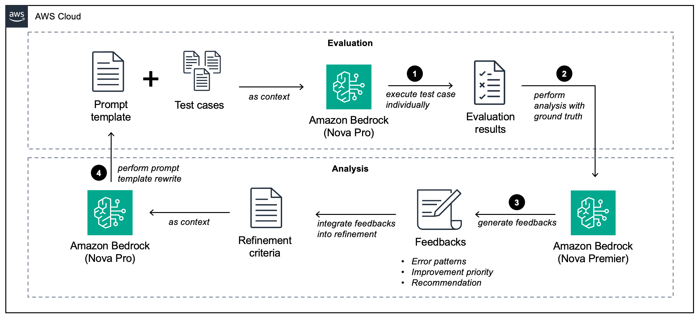

# Feedback-Based Prompt Optimization with Ground Truth

This sample demonstrates an automated approach to prompt optimization using ground truth data and feedback loops. Rather than manually refining prompts through trial and error, we implement a systematic process that leverages model-generated feedback to iteratively improve prompt performance.

## Overview

The notebook implements a complete prompt optimization pipeline:

1. **Initial Evaluation**: Establish a baseline by testing the initial prompt against ground truth data
2. **Error Analysis**: Use a powerful model (Amazon Nova Premier) to analyze error patterns
3. **Feedback Generation**: Generate specific suggestions for prompt improvement
4. **Prompt Refinement**: Implement these suggestions to create an improved prompt
5. **Iterative Evaluation**: Test the new prompt and repeat the process

## Key Components

- **PromptOptimizer**: Analyzes test results and generates improvement suggestions
- **PromptRewriter**: Implements suggested changes to create improved prompts
- **Evaluation Framework**: Measures prompt performance against ground truth data

## Results

The optimization process demonstrates significant improvement in prompt performance across iterations, with accuracy increasing from approximately 52% to 92% over five iterations.

## Requirements

- Python 3.7+
- boto3 1.37.1+
- Access to AWS Bedrock models (Nova Pro, Nova Premier)
- Pandas, NumPy, Matplotlib for data processing and visualization

## Usage

1. Set up AWS credentials with access to Bedrock
2. Run the notebook cells sequentially
3. Observe how prompt performance improves across iterations
4. Analyze the feedback and changes made to understand effective prompt design

This approach can be adapted to optimize prompts for various tasks where ground truth data is available.
