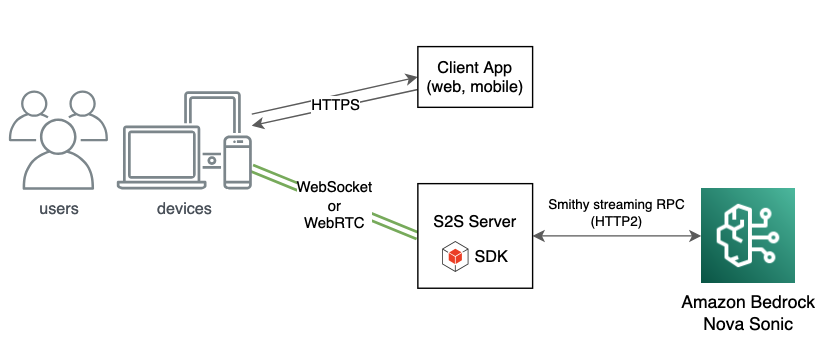

# Sample code for Nova S2S workshop

This project is for the Amazon Nova Sonic speech-to-speech (S2S) workshop and is intended for training purposes. It showcases a sample architecture for building applications that integrate with Nova Sonic, with features specifically designed to expose technical details for educational use.


For architectures that require an internet-exposed connection to serve mobile or web clients, the following approach is recommended:



The project includes two core components:
- A Python-based WebSocket server that manages the bidirectional streaming connection with Nova Sonic.
- A React front-end application that communicates with the S2S system through the WebSocket server.


## Repository Structure
```
nova-s2s-workshop/
├── python-server/                              # Python application serves web socket service and health check HTTP endpoint(optional)
│   ├── server.py                               # Main entry point: starts websocket and health check (optional) servers
│   ├── s2s_session_manager.py                  # Nova Sonic bidirectional streaming logic incapsulated
│   ├── s2s_events.py                           # Utlility class construct Nova Sonic events
│   ├── bedrock_knowledge_bases.py              # Sample Bedrock Knowledge Bases implementation
│   └── requirements.txt                        # Python dependencies
└── react-client/                               # Web client implementation
    ├── src/
    │   ├── helper/
    │   │   ├── audioHelper.js                  # Audio utility functions for encoding/decoding
    │   │   └── s2sEvents.js                    # Utlility class construct Nova Sonic events
    │   ├── static/                             # Images
    │   ├── App.js                              # Define website layout and navigation
    │   ├── index.js                            # Main entry point
    │   └── s2s.js                              # Main entry point
    └── package.json                            # REACT manifest file
```

### Prerequisites
- Python 3.12+
- Node.js 14+ and npm/yarn for UI development
- AWS account with Bedrock access
- AWS credentials configured locally

## Installation instruction
Clone the repository:
    
```bash
git clone https://github.com/aws-samples/amazon-nova-samples
mv amazon-nova-samples/speech-to-speech/workshops nova-s2s-workshop
rm -rf amazon-nova-samples
cd nova-s2s-workshop
```

### Install and start the Python websocket server
1. Start Python virtual machine
    ```
    cd python-server
    python3 -m venv .venv
    ```
    Mac
    ```
    source .venv/bin/activate
    ```
    Windows
    ```
    .venv\Scripts\activate
    ```

2. Install Python dependencies:
    ```bash
    pip install -r requirements.txt
    ```

3. Set environment variables:
    
    The AWS access key and secret are required for the Python application, as they are needed by the underlying Smithy authentication library.
    ```bash
    export AWS_ACCESS_KEY_ID="YOUR_AWS_ACCESS_KEY_ID"
    export AWS_SECRET_ACCESS_KEY="YOUR_AWS_SECRET"
    export AWS_DEFAULT_REGION="us-east-1"
    ```
    The WebSocket host and port must be specified:
    ```bash
    export HOST="localhost"
    export WS_PORT=8081
    ```
    The health check port is optional for container deployment such as ECS/EKS. If the environment variable below is not specified, the service will not start the HTTP endpoint for health checks.
    ```bash
    export HEALTH_PORT=8082 
    ```
    
    You can ignore the Bedrock Knowledge Base Region and ID if you do not plan to test or implement Knowledge Base integration.
    ```bash
    export KB_REGION='YOUR_KNOLEDGE_BASE_REGION_NAME'
    export KB_ID='YOUR_KNOWLEDGE_BASES_ID'
    ```

4. Start the python websocket server
    ```bash
    python server.py
    ```

⚠️ **Warning:** Keep the Python WebSocket server running, then run the section below to launch the React web application, which will connect to the WebSocket service.

### Install and start the REACT frontend application
1. Navigate to the `react-client` folder
    ```bash
    cd react-client
    ```
2. Install
    ```bash
    npm install
    ```

3. Set up environment variables for the REACT app.

    If you've started the WebSocket from the previous step, set REACT_APP_WEBSOCKET_URL to ws://localhost:8081
    ```bash
    export REACT_APP_WEBSOCKET_URL='ws://localhost:8081'
    ```

4. If you want to run the React code outside the workshop environment, update the `homepage` value in the `react-client/package.json` file from "/proxy/3000/" to "."

5. Run
    ```
    npm start
    ```

> Known issue: This UI is intended for demonstration purposes and may encounter state management issues after frequent conversation start/stop actions. Refreshing the page can help resolve the issue.